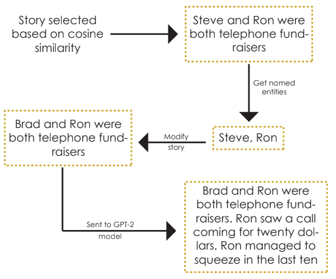
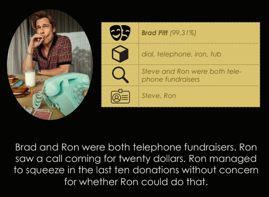

# StoryReel

This project attempts to generate stories from images. It achieves this by combining multiple state-of-the-art neural networks for the tasks of face detection, face recognition, object detection and text generation. It also uses NER and retrieval.

### Models Used

| Task                | Technique                       |
| ------------------- | ------------------------------- |
| Face Detection      | MTCNN                           |
| Face Recognition    | ResNet-50 (trained on VGGFace2) |
| Object Detection    | VGG16 (trained on ImageNet)     |
| Story Retrieval     | Cosine Similarity               |
| NER                 | Spacy                           |
| Story Generation    | GPT-2 (trained on ROCStories)   |

### Flow Diagram

### Report and Poster

The report is uploaded [here](assets/Report.pdf), and a poster demonstrating the project is uploaded [here](assets/Poster.pdf). 

### Sample Outputs

#### Sample Story 1

#### Sample Story 2

